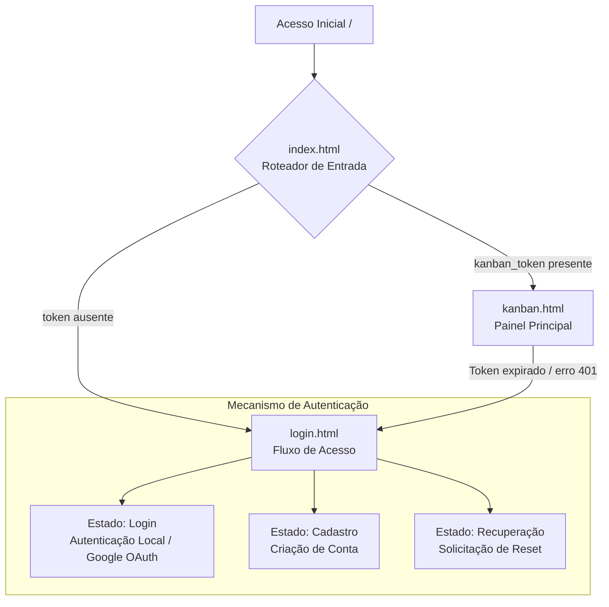

# Kanban Board Web UI 🎨

Interface web do **Kanban Board**, construída em **Vanilla JavaScript** (sem frameworks) e consumindo a API do projeto.  
Este repositório concentra o front-end da aplicação (SPA), com foco em simplicidade, controle direto do DOM e organização modular do código.

> Nota: recursos voltados a **mobile** (especialmente Drag & Drop por toque) existem de forma parcial/experimental e **ainda não foram validados completamente**.

---

## 💡 Motivação

Este projeto surgiu da vontade de aprender como implementar umaa lógica de Drag & Drop. Eu queria uma ferramenta simples para me organizar e se possível melhorar minah produtividade de algum forma. Acabei optando por um quadro Kanban com inspiração estética no Sticky Notes. Ironicamnente, acabei usando o próprio quadro Kanban para planejar e executar o desenvolvimento do quadro Kanban. A partir disso, fui imaginando mais funcionalidades interessantes para explorar e adicionar nele. Esse é o resultado.

---

## 🔗 Links do Projeto

- 🌐 **Aplicação em Produção:** https://kanban.matheusvandeursen.com
- ⚙️ **Repositório do Backend (API):** https://github.com/MatheusVanDeursen/kanban_api

---

## 🖼️ Prévia da Interface (Screenshot)


---

## 📸 Fluxo de Navegação e Estados do Cliente

O roteamento e a troca de telas acontecem no cliente (*Client-Side Routing*), evitando requisições de páginas adicionais ao servidor de hospedagem estática.



---

## ✨ Decisões de Interface e Arquitetura

### 🧩 Arquitetura sem framework (Vanilla JS)

A interface foi implementada sem frameworks (React/Vue/Angular) para manter o bundle enxuto e permitir controle direto sobre renderização e ciclo de vida do DOM.

- Criação e atualização de elementos via APIs nativas (`document.createElement`, `appendChild`, etc.)
- Delegação de eventos (*event delegation*) para reduzir listeners e simplificar manutenção
- Estrutura modular para separar regras de UI, chamadas à API e utilitários

---

### 🧭 Roteamento leve para hospedagem estática

Para lidar com limitações comuns de hospedagem estática (ex.: GitHub Pages), o ponto de entrada (`index.html`) atua como roteador simples.

**Em linhas gerais:**
- Intercepta o carregamento inicial
- Verifica presença/validade do token no `localStorage`
- Redireciona usando `window.location.replace` (evita histórico desnecessário)

---

### 🔄 Sincronização assíncrona e UI otimista

A aplicação adota *Optimistic UI* para manter a experiência mais fluida em ações comuns (criar/editar/remover/mover cards e colunas).

**Como funciona:**
- Atualiza o DOM imediatamente após a ação do usuário
- Realiza a persistência via wrapper centralizado (ex.: `apiFetch`)
- Exibe feedback de sincronização (ex.: “Salvando…”, “Salvo na nuvem”)

**Rollback (quando necessário):**
- Mantém referências do estado anterior (ex.: posição e nó de referência)
- Em falhas (4xx/5xx/offline), restaura a UI para reduzir inconsistências

---

### 📱 Mobile (estado atual)

Há esforços para suportar interação por toque, mas **não é um aspecto totalmente testado/garantido** no momento.

- Drag & Drop por toque: existe suporte inicial e pode depender de *polyfill* (ex.: `MobileDragDrop`)
- Ajustes de gesto/rolagem (ex.: prevenir *pull-to-refresh*) podem exigir calibração por navegador

---

### 🎨 Temas com CSS Variables

O sistema de temas utiliza **CSS Custom Properties** para facilitar ajustes de cor/contraste.

- Controle por classe no `body` (`document.body.classList`)
- Preferência de tema pode ser persistida localmente
- Pode detectar preferências do sistema via `prefers-color-scheme`

---

## 📂 Estrutura de Arquivos

```
root/
│
├── css/
│   └── estilos, variáveis de tema e layout
│
├── scripts/
│   ├── kanban.js
│   ├── login.js
│   └── reset-password.js
│
├── CNAME
│   └── configuração de domínio (quando aplicável)
│
└── *.html
    └── telas separadas (com lógica desacoplada nos scripts)
```

---

## ✅ Status

O front-end está operacional para uso em desktop e fluxos principais.  
Recursos voltados a mobile podem requerer validação adicional e ajustes de compatibilidade.
