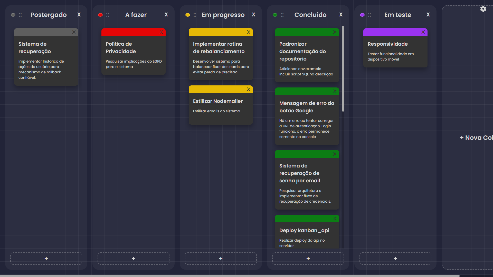
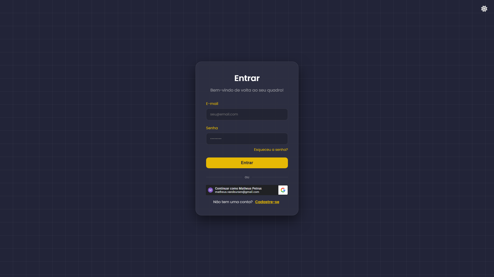
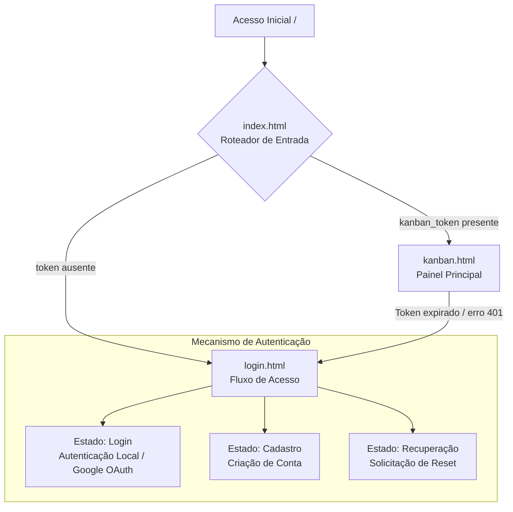

# Kanban Board Web UI 🎨

Interface web do **Kanban Board**, construída em **Vanilla JavaScript** (sem frameworks) e consumindo a API do projeto.  
Este repositório concentra o front-end da aplicação (SPA), com foco em simplicidade, controle direto do DOM e organização modular do código.

> Nota: a aplicação agora conta com **suporte completo a dispositivos móveis**, garantindo uma experiência de Drag & Drop fluida via toque e uma interface totalmente responsiva.

---

## 💡 Motivação

Este projeto surgiu da vontade de aprender como implementar uma lógica de Drag & Drop. Eu queria uma ferramenta simples para me organizar e se possível melhorar minha produtividade de alguma forma. Acabei optando por um quadro Kanban com inspiração estética no Sticky Notes. Ironicamnente, acabei usando o próprio quadro Kanban para planejar e executar o desenvolvimento do quadro Kanban. A partir disso, fui imaginando mais funcionalidades interessantes para explorar e adicionar nele. Esse é o resultado.

---

## 🔗 Links do Projeto

- 🌐 **Aplicação em Produção:** https://kanban.matheusvandeursen.com
- ⚙️ **Repositório do Backend (API):** https://github.com/MatheusVanDeursen/kanban_api

---

## 🖼️ Prévia da Interface

---

## 📸 Fluxo de Navegação e Estados do Cliente

O roteamento e a troca de telas acontecem no cliente (*Client-Side Routing*), evitando requisições de páginas adicionais ao servidor de hospedagem estática.

---

## ✨ Decisões de Interface e Arquitetura

### 🧩 Arquitetura sem framework (Vanilla JS)

A interface foi implementada sem frameworks (React/Vue/Angular) para manter o bundle enxuto e permitir controle direto sobre renderização e ciclo de vida do DOM.

- Criação e atualização de elementos via APIs nativas (`document.createElement`, `appendChild`, etc.)
- Delegação de eventos (*event delegation*) para reduzir listeners e simplificar manutenção
- Estrutura modular para separar regras de UI, chamadas à API e utilitários

---

### 🧭 Roteamento leve para hospedagem estática

Para lidar com limitações comuns de hospedagem estática (ex.: GitHub Pages), o ponto de entrada (`index.html`) atua como roteador simples.

**Em linhas gerais:**
- Intercepta o carregamento inicial
- Verifica presença/validade do token no `localStorage`
- Redireciona usando `window.location.replace` (evita histórico desnecessário)

---

### 🔄 Sincronização assíncrona e UI otimista

A aplicação adota *Optimistic UI* para manter a experiência mais fluida em ações comuns (criar/editar/remover/mover cards e colunas).

**Como funciona:**
- Atualiza o DOM imediatamente após a ação do usuário
- Realiza a persistência via wrapper centralizado (ex.: `apiFetch`)
- **Otimização de requisições:** o sistema avalia o estado anterior e atual dos elementos (ex: edição de texto de cards e colunas), disparando chamadas à API apenas quando há mudanças reais, poupando dados e recursos do servidor.
- Exibe feedback de sincronização (ex.: “Salvando…”, “Salvo na nuvem”)

**Rollback (quando necessário):**
- Mantém referências do estado anterior (ex.: posição e nó de referência)
- Em falhas (4xx/5xx/offline), restaura a UI para reduzir inconsistências

---

### 📱 Suporte Mobile e UX Aprimorada

A interface foi completamente adaptada para oferecer uma experiência de primeira classe e sem atritos em smartphones e tablets.

- **Drag & Drop por toque:** implementado com sucesso utilizando o *polyfill* `MobileDragDrop`, permitindo segurar, arrastar e soltar cartões e colunas com naturalidade e precisão.
- **Responsividade inteligente:** uso de unidades dinâmicas modernas (`100dvh`) para adaptar o quadro perfeitamente às barras de navegação retráteis dos navegadores mobile.
- **Gestos e Usabilidade:** prevenção de comportamentos nativos indesejados (como *pull-to-refresh* acidental), rolagem horizontal automática nas bordas e áreas de toque (*touch targets*) redimensionadas.
- **Interface Imersiva:** alertas nativos foram substituídos por modais personalizados, limpos e integrados ao design do sistema.

---

### 🎨 Temas com CSS Variables

O sistema de temas utiliza **CSS Custom Properties** para facilitar ajustes de cor/contraste.

- Controle por classe no `body` (`document.body.classList`)
- Preferência de tema pode ser persistida localmente
- Pode detectar preferências do sistema via `prefers-color-scheme`

---

### 📧 Fluxos de conta com e-mail (via API)

As comunicações transacionais do sistema são disparadas pelo **backend (Kanban Board API)**, que agora utiliza uma infraestrutura profissional (Resend com domínio autenticado) para garantir a entrega fora da caixa de spam.

Do lado do front-end, a arquitetura foca em gerenciar o estado da interface e o roteamento de forma fluida durante esses eventos:

- **Boas-vindas (Cadastro):** A UI coleta as credenciais, consome o endpoint de registro e trata o feedback visual de sucesso (ou alertas de conflito, caso o e-mail já exista). O disparo do e-mail de boas-vindas ocorre em segundo plano pela API.
- **Recuperação de Senha:** - **Solicitação:** A interface disponibiliza o formulário de resgate e exibe feedbacks neutros de confirmação após o envio (uma boa prática de segurança para evitar confirmar quais e-mails estão na base de dados).
  - **Redefinição:** Quando o usuário clica no link recebido por e-mail, o front-end intercepta o token diretamente via *URL parameters* (`?token=...`), renderiza a tela de nova senha e repassa os dados validados de volta para o backend.

---

## ✅ Status

O front-end está 100% operacional, entregando uma experiência ágil, fluida e agradável tanto em ambientes desktop quanto em dispositivos móveis.
Novas funcionalidade estão por vir!