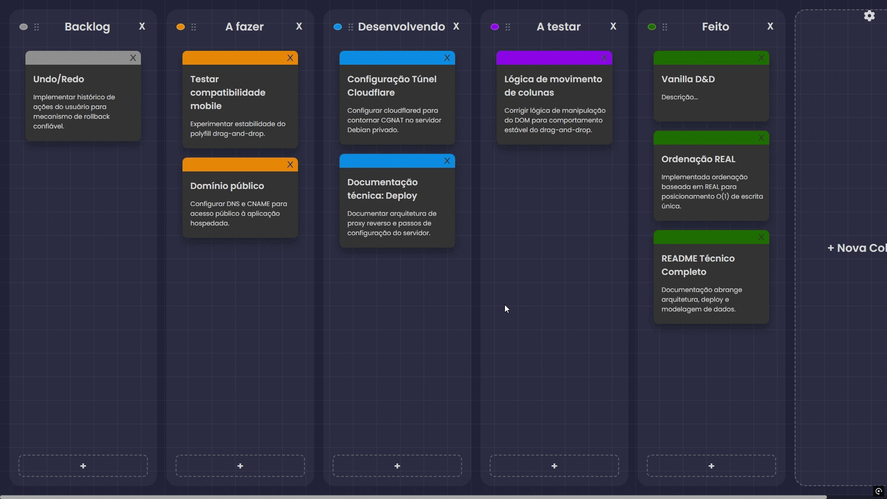
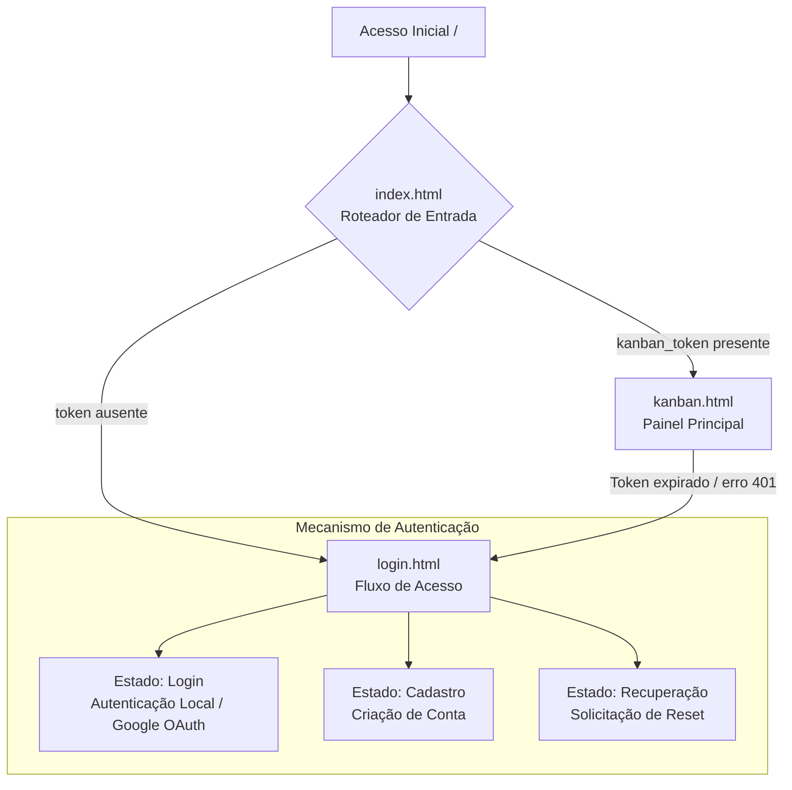

# Kanban Board Web UI 🎨

Interface web do **Kanban Board**, construída em **Vanilla JavaScript** (sem frameworks) e consumindo a API do projeto.  
Este repositório concentra o front-end da aplicação (estruturado como uma **MPA - Multi-Page Application**), com foco em simplicidade, controle direto do DOM e organização modular do código.

> Nota: a aplicação agora conta com **suporte completo a dispositivos móveis**, garantindo uma experiência de Drag & Drop fluida via toque e uma interface totalmente responsiva.

---

## 💡 Motivação

Este projeto surgiu da vontade de aprender como implementar uma lógica de Drag & Drop. Eu queria uma ferramenta simples para me organizar e se possível melhorar minha produtividade de alguma forma. Acabei optando por um quadro Kanban com inspiração estética no Sticky Notes. Ironicamnente, acabei usando o próprio quadro Kanban para planejar e executar o desenvolvimento do quadro Kanban. A partir disso, fui imaginando mais funcionalidades interessantes para explorar e adicionar nele. Esse é o resultado.

---

## 🔗 Links do Projeto

- 🌐 **Aplicação em Produção:** https://kanban.matheusvandeursen.com
- ⚙️ **Repositório do Backend (API):** https://github.com/MatheusVanDeursen/kanban_api

---

## 🖼️ Prévia da Interface

---

## 📸 Fluxo de Navegação e Estados do Cliente

A aplicação adota uma arquitetura de múltiplas páginas (MPA). O controle de acesso (verificação de tokens) e os redirecionamentos de estado ocorrem no cliente de forma dinâmica.

---

## ✨ Decisões de Interface e Arquitetura

### 🧩 Arquitetura sem framework (Vanilla JS)

A interface foi implementada sem frameworks (React/Vue/Angular) para manter o bundle enxuto e permitir controle direto sobre renderização e ciclo de vida do DOM.

- Criação e atualização de elementos via APIs nativas (`document.createElement`, `appendChild`, etc.)
- Delegação de eventos (*event delegation*) para reduzir listeners e simplificar manutenção
- Estrutura modular para separar regras de UI, chamadas à API e utilitários

---

### 🧭 Navegação leve e Controle de Acesso Estático

Para lidar com limitações comuns de hospedagem estática (ex.: GitHub Pages), o ponto de entrada (`index.html`) atua como roteador simples.

**Em linhas gerais:**
- Intercepta o carregamento inicial das páginas
- Verifica presença/validade do token no `localStorage`
- Redireciona usuários entre as páginas (ex: `/login.html` ou `/kanban.html`) usando `window.location.replace` para evitar histórico desnecessário

---

### 🔄 Sincronização assíncrona e UI otimista

A aplicação adota *Optimistic UI* para manter a experiência mais fluida em ações comuns (criar/editar/remover/mover cards e colunas).

**Como funciona:**
- Atualiza o DOM imediatamente após a ação do usuário
- Realiza a persistência via wrapper centralizado (ex.: `apiFetch`)
- **Otimização de requisições:** o sistema avalia o estado anterior e atual dos elementos (ex: edição de texto de cards e colunas), disparando chamadas à API apenas quando há mudanças reais, poupando dados e recursos do servidor.
- Exibe feedback de sincronização (ex.: “Salvando…”, “Salvo na nuvem”)

**Rollback (quando necessário):**
- Mantém referências do estado anterior (ex.: posição e nó de referência)
- Em falhas (4xx/5xx/offline), restaura a UI para reduzir inconsistências

---

### 📱 Suporte Mobile e UX Aprimorada

A interface foi completamente adaptada para oferecer uma experiência de primeira classe e sem atritos em smartphones e tablets.

- **Drag & Drop por toque:** implementado com sucesso utilizando o *polyfill* `MobileDragDrop`, permitindo segurar, arrastar e soltar cartões e colunas com naturalidade e precisão.
- **Responsividade inteligente:** uso de unidades dinâmicas modernas (`100dvh`) para adaptar o quadro perfeitamente às barras de navegação retráteis dos navegadores mobile.
- **Gestos e Usabilidade:** prevenção de comportamentos nativos indesejados (como *pull-to-refresh* acidental), rolagem horizontal automática nas bordas e áreas de toque (*touch targets*) redimensionadas.
- **Interface Imersiva:** alertas nativos foram substituídos por modais personalizados, limpos e integrados ao design do sistema.

---

### 🎨 Temas com CSS Variables

O sistema de temas utiliza **CSS Custom Properties** para facilitar ajustes de cor/contraste.

- Controle por classe no `body` (`document.body.classList`)
- Preferência de tema pode ser persistida localmente
- Pode detectar preferências do sistema via `prefers-color-scheme`

---

### 📧 Fluxos de conta com e-mail (via API)

As comunicações transacionais do sistema são disparadas pelo **backend (Kanban Board API)**, que agora utiliza uma infraestrutura profissional (Resend com domínio autenticado) para garantir a entrega fora da caixa de spam.

Do lado do front-end, a arquitetura foca em gerenciar o estado da interface e o roteamento de forma fluida durante esses eventos:

- **Boas-vindas (Cadastro):** A UI coleta as credenciais, consome o endpoint de registro e trata o feedback visual de sucesso (ou alertas de conflito, caso o e-mail já exista). O disparo do e-mail de boas-vindas ocorre em segundo plano pela API.
- **Recuperação de Senha:**
  - **Solicitação:** A interface disponibiliza o formulário de resgate e exibe feedbacks neutros de confirmação após o envio (uma boa prática de segurança para evitar confirmar quais e-mails estão na base de dados).
  - **Redefinição:** Quando o usuário clica no link recebido por e-mail, o front-end intercepta o token diretamente via *URL parameters* (`?token=...`), renderiza a tela de nova senha e repassa os dados validados de volta para o backend.

---

### ⚙️ Página de Conta com Gerenciamento de Preferências

Novo módulo (`account.html` / `account.js`) que permite ao usuário personalizador completamente sua experiência na plataforma.

**Funcionalidades principais:**

1. **Informações da Conta**
   - E-mail conectado e data de criação da conta
   - Opção de login com Google OAuth

2. **Preferências Visuais**
   - **Tema:** alterna entre modo escuro e modo claro com CSS Variables
   - **Visão Compacta:** reduz espaçamentos e tamanhos de elementos em ~15-20% para melhor aproveitamento de espaço em mobile

3. **Preferências de Comportamento**
   - **Efeitos Sonoros:** habilita/desabilita áudio em 7 contextos diferentes
   - **Confirmação ao Deletar:** exige confirmação antes de remover cards ou colunas
   - **Posição de Novo Card:** define se cards novos aparecem no topo ou final da coluna

4. **Estilo e Branding**
   - **Cor Padrão:** color picker para escolher a cor primária dos cards

**Sincronização:**
- Todas as preferências são **sincronizadas em tempo real** tanto no `localStorage` (acesso imediato) quanto na API (persistência)
- Alterações são aplicadas instantaneamente na interface
- Preferências persistem entre sessões e dispositivos

---

### 🔊 Sistema de Áudio Integrado

O sistema implementa efeitos sonoros contextuais em diferentes ações, melhorando o feedback tátil visual da experiência de uso.

**Arquitetura (`scripts/utils/audioManager.js`):**
- **Detecção de Compatibilidade:** o sistema detecta automaticamente qual formato de áudio o navegador suporta (WAV, MP3, OGG, AAC, AIFF)
- **Fallback Inteligente:** se o formato preferido não for suportado, tenta alternativas em cascata
- **Gerenciamento de Estado:** sincroniza preferência de áudio com localStorage e API

**Eventos com Áudio:**
- 🎵 **pick** (`drag.wav`) — Quando usuário inicia arrastar um card/coluna
- 🎵 **drop** (`drop.wav/drop.aiff`) — Quando card/coluna é solto após movimentação
- 🎵 **create** (`menu_click.wav`) — Ao criar novo card ou coluna
- 🎵 **loaded** (`loaded_board.wav`) — Quando quadro termina carregamento
- 🎵 **switch** (`switch.wav`) — Ao ativar/desativar preferências (tema, som, modo compacto, etc.)
- 🎵 **trash_card** (`card_thrash.wav`) — Ao deletar um card
- 🎵 **trash_column** (`column_thrash.wav`) — Ao deletar uma coluna

**Implementação:**
- Sons estão pré-carregados ao inicializar a página (`preloadSounds()`) para evitar latência
- Erros de reprodução (ex: bloqueio de autoplay do navegador) são tratados silenciosamente
- Preferência de áudio pode ser ativada/desativada a qualquer momento sem recarregar a página

---

### 📱 Modo Compacto para Mobile

O modo compacto é uma variante otimizada da interface especialmente calibrada para **dispositivos móveis com telas pequenas** (< 600px), mantendo legibilidade e usabilidade.

**Ativação:**
- Toggle em `account.html` → "Visão Compacta"
- Salva em preferências do usuário
- Aplica classe `compact-mode` ao `body` que redimensiona globalmente

**Redimensionamentos (`css/kanban.css`):**
- **Colunas:** 320px → 260px de largura
- **Cards:** 250px → 220px de largura, altura mínima 150px → 100px
- **Padding/Espaçamentos:** ~30px → 20px (em cards e colunas)
- **Tipografia:** títulos e conteúdos reduzem ~10-15%
- **Border-radius e gaps:** ajustados proporcionalmente para manter harmonia visual

**Benefício:**
- Cabe até ~30% mais conteúdo na tela ao mesmo tempo
- Mantém touch targets (botões/checkboxes) com tamanho adequado para toque
- Responsivo também na página de conta (`css/account.css`)

---

### 🛡️ Política de Privacidade e Transparência (LGPD)

Para demonstrar boas práticas de segurança, transparência e adequação legal em projetos web, o sistema conta com uma página dedicada à **Política de Privacidade** (`privacy-policy.html`).

**Destaques da implementação:**
- **Conformidade (LGPD):** Documentação clara e em linguagem simples sobre quais dados são coletados (e-mail, preferências, conteúdo do quadro), infraestrutura utilizada e direitos do usuário.
- **Privacidade por Padrão (*Privacy by Default*):** A documentação garante e explica a ausência total de rastreadores, ferramentas de *analytics* ou cookies de publicidade na plataforma.
- **Integração Visual Inteligente:** Através do script `privacy-policy.js`, a página detecta as preferências locais do usuário para aplicar automaticamente o modo escuro/claro e o modo compacto, mantendo a harmonia visual. Além disso, o botão de navegação se adapta contextualmente, redirecionando para o login ou para o quadro dependendo se o usuário possui um token ativo.

---